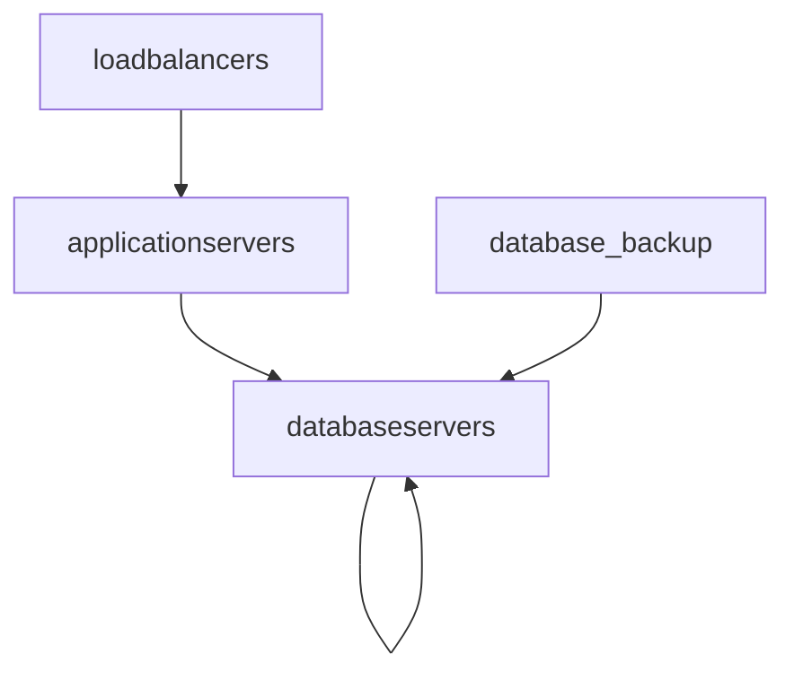

# Mehsh

Mehsh allows to monitor the network between N servers for failures.
It sends UDP packets from server to server and measures how many packets have disappeared.

Mehsh allows more complex configurations.  So it is possible to define the complete server landscape in a configuration file and to specify the current server when starting Mehsh (default is the hostname).

### Example 1 (works local)

mehsh.toml:
```toml
# you have to group servers into groups, 
# in practive this might be "loadbalancers", "webservers", "storageservers", ... 
# to make this example as simple as possible we've just one group named all
[[group]]
name = "all"

# you've define to define every server, when you've 100 servers you would end up 
# with 100 [[server]] blocks. Every server has a name, an ip and is part of N groups.
[[server]]
name = "local"
ip = "127.0.0.1"
datacenter = "fra.dc11" # optional, datacenter of the server. great to see if a whole datacenter has issues
groups = ["all"]

[[server]]
name = "fail"
ip = "127.0.222.1"
datacenter = "fra.dc12"
groups = ["all"]

# now comes the real check
# we're checking with the udp_ping from "local" to "all".
# in real applications you would create one check per usecase.
# For example, one check that checks the connection of load balancers to application servers 
# and another check that checks the connection from the application server to the database server.
# And maybe another check that checks the connection between 
# the database servers to detect replication problems before they occur.
[[check]]
from = "local" # could be a servername or a group
to = "all" # could be a servername or a group
check = "udp_ping"
```

now you could download and run mehsh

```
mehsh_check example/local.toml --name=local # name is the name defined in the toml as server.name
```

Output
In the output you can see that the server local has a problem to reach fail, but local itself is reached.
in addition, you see an aggregated view for each datacenter. If you specify a "." at the datacenter, each of these blocks will be aggregated for itself.

Fields:

- server: `[from] -> [to]`, name of the server defined in the `[[server]]` block.
- ip: Ip of the `to server`.
- req: Number of udp packets that were send.
- resp: Number of the udp packets that received a pont. (successful req)
- max_lat: Max latency between sending and receiving a package
- min_lat: Min latency between sending and receiving a package
- loss: Number of packages lost. results from the calculation of  `req - resp`

```
2022-03-25 09:56:37 server: local -> fail, ip: 127.0.222.1, req: 161, resp: 0, max_lat: None, min_lat: None, loss: 161, withloss
2022-03-25 09:56:37 server: local -> local, ip: 127.0.0.1, req: 161, resp: 161, max_lat: Some(243), min_lat: Some(51), loss: 0, withoutloss
2022-03-25 09:56:37 datacenter: fra.dc11 -> fra, req: 322, resp: 161, max_lat: None, min_lat: None, loss: 161, withloss
2022-03-25 09:56:37 datacenter: fra.dc11 -> fra.dc12, req: 161, resp: 0, max_lat: None, min_lat: None, loss: 161, withloss
2022-03-25 09:56:37 datacenter: fra.dc11 -> fra.dc11, req: 161, resp: 161, max_lat: Some(243), min_lat: Some(51), loss: 0, withoutloss
# repeats every second.
```

### Example 1 (lamp stack)



```toml
[[group]]
name = "loadbalancers"

[[group]]
name = "applicationservers"

[[group]]
name = "databaseservers"

[[server]]
name = "loadbalancer1"
ip = "v4:127.0.2.2"
groups = ["loadbalancers"]

[[server]]
name = "loadbalancer2"
ip = "v4:127.0.2.3"
groups = ["loadbalancers"]

[[server]]
name = "applicationserver1"
ip = "v4:127.0.3.2"
groups = ["applicationservers"]

[[server]]
name = "applicationserver2"
ip = "v4:127.0.3.3"
groups = ["applicationservers"]

[[server]]
name = "databaseserver1"
ip = "v4:127.0.4.2"
groups = ["databaseservers"]

[[server]]
name = "databaseserver2"
ip = "v4:127.0.4.3"
groups = ["databaseservers"]

[[server]]
name = "databaseserver3"
ip = "v4:127.0.4.4"
groups = ["databaseservers"]

[[server]]
name = "database_backup"
ip = "v4:127.0.5.1"
groups = []

# load balancers needs to access applicationservers
[[check]]
from = "loadbalancers"
to = "applicationservers"
check = "udp_ping"

# applicationservers needs access to the database servers
[[check]]
from = "applicationservers"
to = "databaseservers"
check = "udp_ping"

# database servers must see each other
[[check]]
from = "databaseservers"
to = "databaseservers"
check = "udp_ping"

# backup server needs access to database servers
[[check]]
from = "database_backup"
to = "databaseservers"
check = "udp_ping"
```

now you could start mehsh on each server with the corrent `--name` argument. The name defaults to the hostname. 